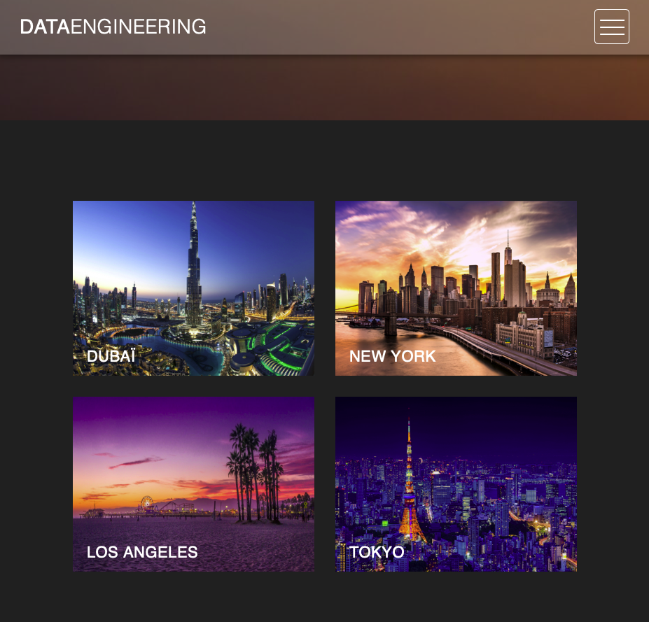
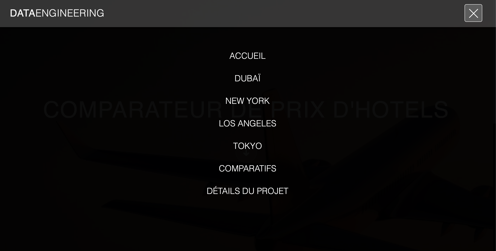
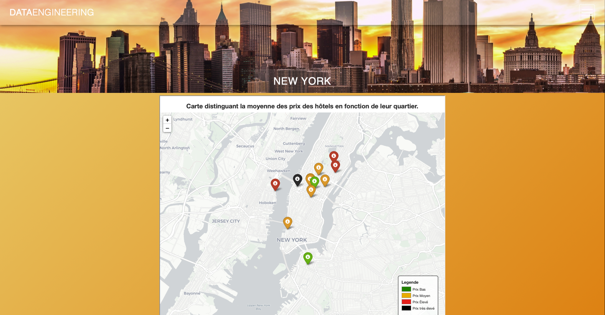
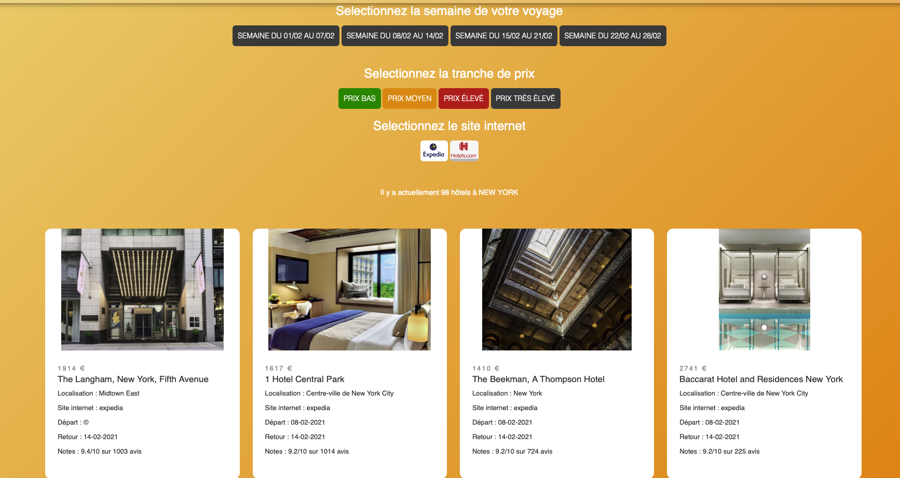
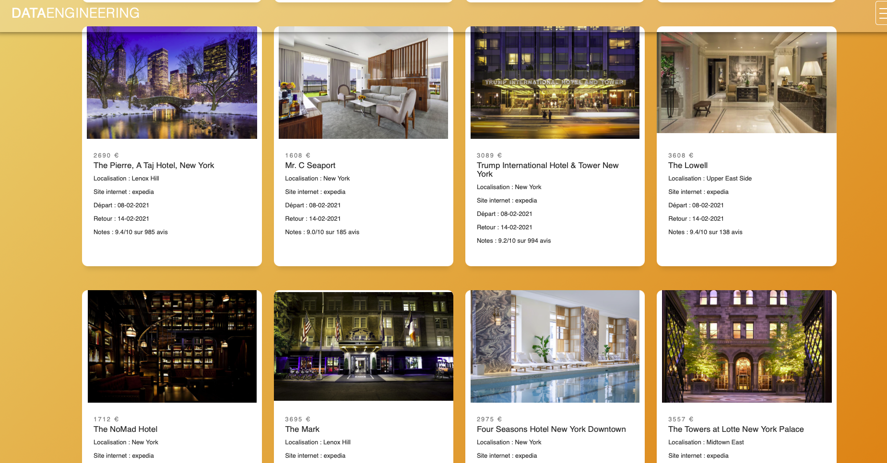
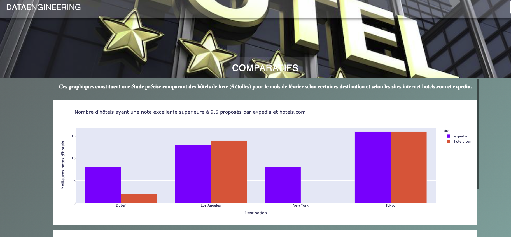

## Lancement

Lancez docker et la ligne de commande:
```bash
docker-compose up -d
```
Lancez la commande pour charger tous les packages nécessaires:
```bash
pip install -r requirements.txt
```
Executez le script:
```bash
python 'views.py'
```
Rendez vous à l'adresse indiquée par le terminal.

## Page d'acceuil

<p align= "center">

</p>

<p align= "center">

</p>

## Barre de recherche

<p align= "center">

</p>

## Pages de données scrapées

- Graphique des prix en moyenne selon le quartier:

<p align= "center">

</p>

- Boutton disponible pour filtrer les données:

<p align= "center">

</p>

- Liste des données scrapées:

<p align= "center">

</p>

## Dashboard

<p align= "center">

</p>


